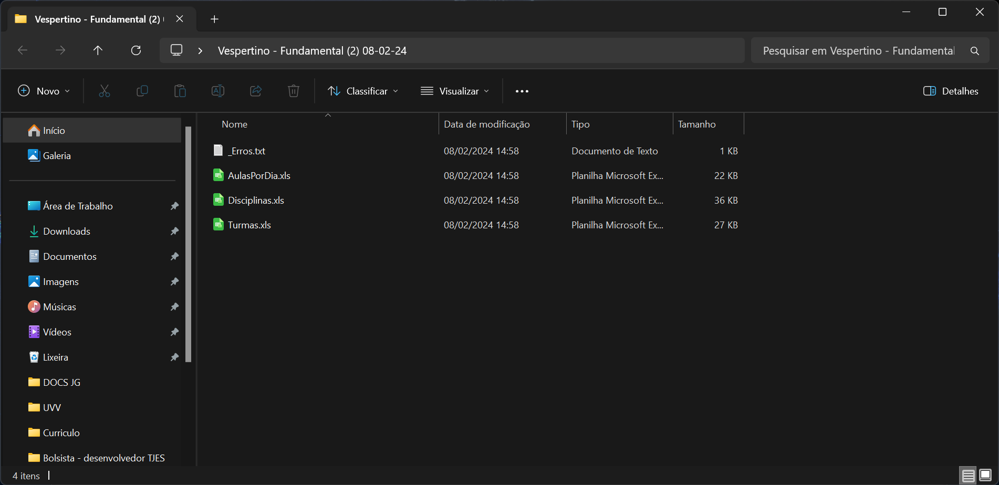

# Classort

O Classort é um projeto desenvolvido para a Escola Lia Therezinha Merçon Rocha, capaz de gerar horários de aulas semanais. O projeto foi implementado utilizando Java Swing para a interface gráfica e PostgreSQL para o armazenamento de dados.

## Descrição

O Classort é uma aplicação desenvolvida para automatizar o processo de geração de horários de aulas semanais na Escola Lia Therezinha Merçon Rocha. Com a ajuda do Classort, é possível cadastrar professores, turmas, turnos e possíveis restrições, e a partir desses dados, o programa gera um horário semanal de aulas de forma eficiente e otimizada.

## Funcionalidades

- Cadastro de professores, turmas, aulas, turnos e restrições.
- Geração automática de horários de aulas semanais.
- Visualização e edição dos horários gerados.
- Exportação dos horários em formato XLS.

## Tecnologias Utilizadas

- Java Swing: Utilizado para desenvolver a interface gráfica do programa.
- PostgreSQL: Banco de dados utilizado para armazenar os dados do sistema.

## Como Instalar

1. Certifique-se de ter o Java Development Kit (JDK) e o PostgreSQL instalados em seu sistema.
2. Clone este repositório para o seu computador.
3. Importe o arquivo .jar na branch main.
5. Execute o programa e comece a utilizar o Classort!

# Como Usar:

Ao abrir o Classort pela primeira vez, será solicitada a conexão com o banco de dados. Este procedimento, necessário apenas uma vez pelo técnico instalador, salvará as credenciais do cliente para futuras execuções do programa. Se o esquema "classortbd" não existir, será criado automaticamente:

Após isso, o turno será selecionado. (Será possível criar turnos personalizados nas próximas atualizações):

Avançando, o usuário poderá realizar o CRUD das turmas:

Em seguida, o usuário poderá realizar o CRUD das disciplinas, com seus respectivos professores, aulas duplas e aulas que não podem ser agendadas:

Assim, na próxima tela, o usuário poderá adicionar disciplinas e quantidades de aulas às turmas, que estão distribuídas em um layout intuitivo de paginação via botões laterais:

Ao clicar em "Gerar horários" haverá uma tela que confirma se não existem professores com mais aulas que o permitido, ou turmas com aulas vagas. Caso haja algum problema, o usuário é obrigado a retornar, e caso esteja tudo certo, ele poderá prosseguir:

Assim, finalmente, os horários serão exibidos, podendo ser visualizados na perspectiva da turma, do professor, e por dia da semana:

Caso as restrições não permitam que um horário seja matematicamente gerado, uma tela notificará onde não foi possível enquadrar determinado professor:

Ao clicar em "exportar", será aberto um explorador de arquivos, onde o usuário pode escolher o diretório para salvar as planilhas com os horários

E por fim, será criada uma pasta no diretório selecionado, com as planilhas separadas tambem por dia, disciplina e professor, onde cada uma das entidades cadastrada é uma sheet (folha) da planilha

